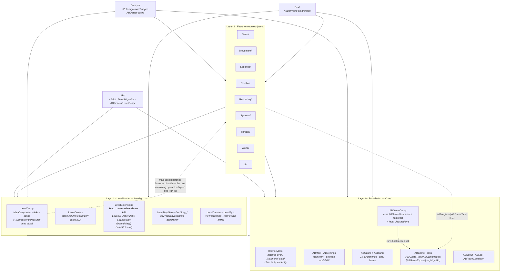
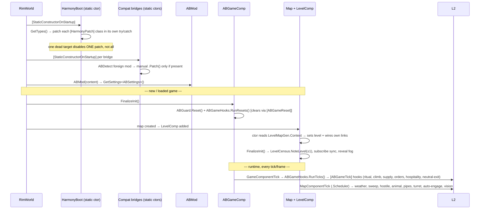
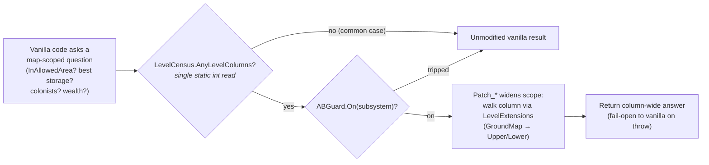

# As above, So below — Architecture (V1 — DELETED)

> # ⚠ THIS DOCUMENT DESCRIBES CODE THAT NO LONGER EXISTS
>
> **V1 was deleted: 156 files / 40,713 LOC.** Nothing described below is on disk any more.
> This file is retained ONLY for the reasoning it records about why V1 was replaced — treat
> every class, file and mechanism it names as historical.
>
> Current documentation: **`docs/V2-HANDOFF.md`**, and the Schematic
> (`.modmixer/schematic.json`), which is the living version.
>
> The mod was rearchitected. **V2 stacks three bands into ONE `Map`** joined by synthetic
> `RegionLink` wormholes, instead of V1's three separate pocket maps bridged by ~130 Harmony
> patches. V2 lives in `Source/V2/`; everything described below is the V1 model.
>
> **→ Current architecture and handoff: [`docs/V2-HANDOFF.md`](docs/V2-HANDOFF.md)**
>
> This file is kept deliberately. Sections 1–8 are still the best record of *what V1 did*,
> and §9 plus the diagnosis that opens the handoff explain *why it was replaced* — the
> ambiguity of `IntVec3` across maps, `Thing.Map` being a single `sbyte`, and the
> decision-versus-execution split that produced the ping-pong bugs. Do not follow it as
> guidance for new work.

---

> **Living document (V1 era).** This is the map of the V1 system. Update it in the *same commit* as any
> structural change — a new module folder, a new tick hub, a new cross-cutting pattern, a
> renamed public API. If a diagram below no longer matches the code, the diagram is the bug.
>
> Last synced: 2026-07-26 · Pass 42 (perf gates) + refactor pass R1–R4 (tick registry / partial splits / compat registry).
> Regenerate the whole-codebase snapshot for high-level chats with `docs/generate-helicopter-view.sh`.

---

## 1. The one-sentence thesis

Stack up to three real, fully-simulated maps in one vertical column (sky `+1` / surface `0` /
basement `-1`) and make the whole column behave as **ONE BIG MAP** — by intercepting the vanilla
questions ("is this cell in the allowed area?", "where's the best storage?", "who are my
colonists?") with ~130 Harmony patches that widen the answer from a single `Map` to the whole
column, while a tier-1 static gate keeps every one of those patches free until a column exists.

Design priorities, in order: **(1)** visual clarity from the sky, **(2)** performance,
**(3)** full vanilla parity.

---

## 2. Codebase at a glance

| Metric | Count |
|---|---|
| C# files | 165 |
| C# lines | 42,495 |
| Defs + Patches XML files | 14 |
| Defs + Patches XML lines | 1,428 |
| All XML incl. About + Languages | 1,851 |
| **Total code (C# + Defs/Patches)** | **~43,923** |
| Declarative `Patch_*` Harmony classes | 110 |
| Imperative `.Patch()` calls (Compat) | 24 |
| `[HarmonyPatch]` attribute usages | 113 |
| Per-subsystem kill switches (`ABGuard`) | 19 |
| Foreign-mod compat bridges | ~30 |

Largest files after the R1–R4 refactor pass: `Logistics/CrossLevelDemand.cs` (1,489) and
`Rendering/LevelRenderer.cs` (1,260) — deliberately left intact (R5). The old 2,559-LOC
`Dev/ABDevTools.cs` monolith is gone, split into domain partials (R2). See §7 and §9.

---

## 3. Repository map (ASCII)

```
50b4332c2547/                        mod root (folder id is opaque; identity lives in About.xml)
├─ About/                            About.xml (identity, deps, incompat) + Preview.png
├─ Assemblies/                       AsAboveSoBelow.dll  (build output — the ONLY shipped dll)
├─ Defs/                             XML content (1,428 LOC across 10 files)
│  ├─ Animations/  Biomes/  Buildings/     climb anims · basement biomes · stairs+links
│  ├─ Jobs/  KeyBindings/  MapGeneration/  cross-level jobs · view hotkeys · gen defs
│  ├─ Misc/  Terrain/  WorkGivers/         mesh flags · sky/basement terrain · haul givers
├─ Patches/                          PatchOperations: DBH/Rimefeller/VCHE/VEF vertical pipes
├─ Languages/English/Keyed/          C#-emitted strings (translate everything player-facing)
├─ Textures/                         stairs/ladder/elevator art (MORTON pack) + UI icons
└─ Source/                           C# (42,495 LOC, 165 files, one namespace: AsAboveSoBelow)
   │
   ├─ Core/        (~1,864 · 9)  FOUNDATION — boot, settings, kill switches, ABGameHooks tick registry
   ├─ API/         (  498 · 2)   PUBLIC modder surface — cross-level jobs, need migration, policy
   ├─ Levels/      (~4,410 · 21) LEVEL MODEL — LevelComp(+.Scheduler), LevelCensus, LevelExtensions, gen, camera
   │
   ├─ Stairs/      (1,898 · 6)   vertical links: buildings, use-job, climb animation
   ├─ Movement/    (3,776 · 9)   cross-level RMB orders, work-priority migration, targeting
   ├─ Logistics/   (6,834 · 26)  hauling, demand, column storage, needs, construction supply
   ├─ Combat/      (3,667 · 11)  cross-gap shooting, turrets, projectiles, formation drag
   ├─ Rendering/   (3,604 · 8)   see-below, section layers, DrawPos offset patcher
   ├─ Systems/     (2,957 · 12)  areas, climate, rituals, animals, utility grid links
   ├─ Threats/     (1,524 · 5)   pods to sky, infestations, hostile descent, raid diverts
   ├─ World/       (  575 · 4)   caravans, trade, wealth, comms, abandon warning
   ├─ UI/          (2,536 · 13)  colonist bar, alerts, tables, selection, play-settings buttons
   │
   ├─ Compat/      (~5,700 · 31) foreign-mod bridges + ABCompat registry (ABDetect/ABCompat.Detect gated)
   └─ Dev/         (2,678 · 8)   ABDevTools.*.cs: self-test/diagnostics, split into domain partials (R2)
```
`(LOC · files)`. `obj/` and `bin/` are gitignored build scratch.

---

## 4. Layered dependency graph

Everything points **down**. Since the R1 refactor, game-scoped ticks are decoupled: features
self-register `[ABGameTick]` hooks that `ABGameHooks` discovers by reflection, so `ABGameComp`
holds no direct feature refs. The one remaining upward edge (dashed) is `LevelComp`'s per-map
tick scheduler, kept explicit on purpose (perf + heterogeneous scheduling — see §9 R1/R3).



**Reading it:** `LevelExtensions` is the single most-depended-on type — nearly every feature file
calls `map.Levels()` / `map.GroundMap()` / `a.SameColumn(b)`. If you change that API, expect
ripples everywhere. `ABGuard.On(...)` is the second: every hot path and every subsystem entry
point is wrapped in a kill switch. The static perf gate `LevelCensus.AnyLevelColumns` is read at
the top of ~27 hot patches; `ABGameHooks` is the reflection-driven registry the game-tick loop runs.

---

## 5. Boot & lifecycle sequence



The **two tick hubs** are `ABGameComp` (per game) and `LevelComp.MapComponentTick` (per map, in
the `.Scheduler` partial). Game-scoped work is now self-registered via `[ABGameTick]` and run by
`ABGameHooks` (R1); map-scoped work stays explicit in the scheduler. Both early-out on a static
count read (`LevelCensus.AnyLevelColumns`) so a zero-column game pays almost nothing.

---

## 6. The "ONE BIG MAP" request-interception pattern

This is the core idiom repeated ~110 times. Vanilla asks a scoped question about *one* map; a
`Patch_*` widens the scope to the whole column via `LevelExtensions`, gated for performance.



**Two invariants that make this safe:**
1. **The gate is a superset of every patch's real precondition.** `AnyLevelColumns` (sky-count +
   basement-count > 0, keyed to the current `Game` by weak reference) is true whenever *any*
   column exists anywhere, which is a strict superset of "this specific map is in a column." So
   early-outing on it is behavior-preserving — it can only skip patches that were going to no-op.
2. **Every subsystem fails open.** A `Patch_*` prefix that throws trips its `ABGuard` switch,
   logs once with a blamed culprit, and thereafter returns `true` (vanilla runs). One broken
   subsystem never cascades.

---

## 7. Module reference

| Module | LOC·files | Role | Key types |
|---|---|---|---|
| **Core** | ~1,864·9 | Foundation: boot, settings, kill switches, tick registry | `HarmonyBoot` · `ABMod` · `ABSettings` · `ABGuard`/`ABBlame` · `ABGameComp` · `ABGameHooks` |
| **API** | 498·2 | Public modder surface | `ABApi` · `NeedMigration` · `ABIncidentLevelPolicy` · `ABSkyfallerTransit` |
| **Levels** | ~4,410·21 | The level model + census + generation + camera + sync | `LevelComp`(+`.Scheduler`) · `LevelCensus` · `LevelExtensions` · `LevelMapGen` · `GenStep_AB*` · `LevelCamera` · `LevelSync` |
| **Stairs** | 1,898·6 | Vertical links | `Building_ABStairs`/`ABElevator`/`ABUtilityLink` · `JobDriver_UseStairs` · `ClimbAnimation` |
| **Movement** | 3,776·9 | Cross-level RMB orders + work-priority migration | `CrossLevelOrders` · `CrossLevelWork` · `CrossLevelTargeting` · `StairRouter`/`StairIslands` |
| **Logistics** | 6,834·26 | Hauling, demand, column storage, needs, supply | `CrossLevelHaul`/`HaulChain` · `CrossLevelDemand` · `ColumnStorage` · `ABGearAcrossLevels` · `WorkGiver_AB*` |
| **Combat** | 3,667·11 | Cross-gap shooting, turrets, formation drag | `CrossLevelCombat` · `CrossLevelTurret` · `CrossGapProjectiles` · `CrossLevelAutoEngage` · `ABBelowGotoDrag` |
| **Rendering** | 3,604·8 | See-below view + draw offsets | `LevelRenderer` · `DrawPosOffsetPatcher` · `SectionLayer_ABBelowThings/Ceiling/MountainCap/WallFacade/WallReveal` |
| **Systems** | 2,957·12 | Column-wide areas, climate, rituals, animals | `AreasAcrossLevels` · `ClimateSync`/`LevelClimate` · `ABRitualAttendance` · `CrossLevelAnimals` · `CompABGridLink` |
| **Threats** | 1,524·5 | Optional threats & arrivals | `HostileDescend` · `PodTransit` · `ThreatDivert` · `SkyArrivals` |
| **World** | 575·4 | Planet integration | `CaravanAcrossLevels` · `ColumnTrade` · `ColumnWorld` |
| **UI** | 2,536·13 | HUD, alerts, tables, selection | `BelowSelection` · `ABGenPreview` · `ABIcons`/`ABTheme` · `Dialog_ABDeleteLevel` |
| **Compat** | ~5,700·31 | Foreign-mod bridges + `ABCompat` registry | `ABCompat`/`ABDetect` · DBH/Rimefeller/VEF pipes · CE · Vehicles · Hospitality · CAI5000 · Biomes Caverns · Ancient Urban Ruins |
| **Dev** | 2,678·8 | Self-test / diagnostics (domain partials) | `ABDevTools.*` (Combat/Movement/Systems/Levels/Rendering/Threats/Logistics) |

---

## 8. Cross-cutting patterns (learn these once, they're everywhere)

- **`map.Levels()` backbone** (`Levels/LevelExtensions.cs`). Every column relationship goes
  through these extensions, `ConditionalWeakTable`-cached per map. `GroundMap()` self-heals by
  walking links when the field is unset (old saves). Never cache a `Map` link yourself — ask.
- **Kill switches** (`Core/ABGuard.cs`). 19 `ABGuardSwitch` singletons. Pattern: guard the entry
  (`if (!ABGuard.On(ABGuard.X)) return;`), `try { … } catch (e) { ABGuard.Disable(ABGuard.X, e, "ctx", subject); }`.
  Prefixes must **fail open**. Switches reset on load and are re-armable from settings.
- **Tier-1 static perf gates** (`LevelCensus.AnySkyLevels` / `AnyBasementLevels` / `AnyLevelColumns`).
  First line of every hot cross-level patch. Superset of the real precondition ⇒ behavior-preserving.
  Keyed to `Current.Game` by weak reference; a stale count only ever *degrades* the optimization.
  (Extracted from `LevelComp` in R3; `LevelComp` feeds the counts via `LevelCensus.NoteLevel`.)
- **Two tick hubs.** `ABGameComp` (game-scoped) and `LevelComp.MapComponentTick` (map-scoped, in
  the `.Scheduler` partial). Game-scoped features self-register `[ABGameTick]`/`[ABGameReset]`/
  `[ABGameExpose]` and `ABGameHooks` runs them (R1) — add a ticked feature by annotating its own
  method, no Core edit. Map-scoped work stays explicit and uses elapsed-time
  `Due(ref due, now, interval)` with a per-map stagger, not `TicksGame % n` (modulo beats are
  missed across time-skips/loads).
- **Compat bridges** (`Compat/*`). Each is `[StaticConstructorOnStartup]` + a detection probe +
  manual `HarmonyBoot.Harmony.Patch(...)`, active only if the foreign mod is loaded. Detection now
  routes through `ABCompat.Detect(id, name)`/`ABCompat.Note(...)` (R4) so every target lands in one
  auditable registry (`ABCompat.Modules`, dumpable via the "AB: list compat modules" Dev action);
  `ABCompat.Setup()` is the go-forward boot helper. Bridges carry **no** `[HarmonyPatch]` attribute
  (so `HarmonyBoot` never reflects their foreign-typed method signatures — that was the "Skipped
  patch class RimefellerBridge" ghost-warning trap).
- **Localization.** Player-facing C# strings go through `"AB_Key".Translate()` with the key in
  `Languages/English/Keyed/AsAboveSoBelow.xml`. Def labels/descriptions are DefInjected (don't hand-author).

---

## 9. Refactor backlog (honest assessment)

The 2026-07-26 pass applied R1–R4 (all behavior-preserving, green 0/0) and recorded R5 as a
deliberate non-split. History kept here so the reasoning survives.

- **R1 · Tick-hub coupling — DONE (game-scoped).** `Core/ABGameHooks.cs` is a reflection-discovered
  registry: features annotate their own static methods `[ABGameTick]` / `[ABGameReset]` /
  `[ABGameExpose]` and `ABGameComp` just runs them (deterministic order by [Order]+name, zero
  per-tick allocation). Core no longer lists feature tick calls. **Scope note:** `LevelComp`'s
  *map-scoped* tick loop was deliberately NOT genericized — its scheduling is heterogeneous
  (every-tick vs interval vs sweep-cursor vs on-view catch-up vs visibility throttle) and lives on
  the perf-critical MapComponent, so a generic registry there would add risk/cost for little gain.
  It stays explicit in the `.Scheduler` partial (see R3).
- **R2 · `ABDevTools` monolith — DONE.** Split into domain partials (`ABDevTools.Combat.cs`,
  `.Movement.cs`, `.Systems.cs`, `.Levels.cs`, `.Rendering.cs`, `.Threats.cs`, `.Logistics.cs`) plus
  the core file (setup action + shared helpers). Same `partial class`, byte-identical bodies.
- **R3 · Split `LevelComp` — DONE.** `LevelCensus` (standalone class) owns the static column-count
  perf gates; the per-map tick scheduler + sync wiring moved to the `LevelComp.Scheduler.cs`
  partial. `LevelComp.cs` is now the model (links, stairs registry, scribe). All ~27 gate call
  sites read `LevelCensus.*`.
- **R4 · Compat registry — DONE (framework + full audit).** `Compat/ABCompat.cs` is the central
  registry; all detections route through `ABCompat.Detect`/`.Note`, so the whole soft-compat surface
  is auditable in one place (`ABCompat.Modules`, dumped by the "AB: list compat modules" Dev
  action). `ABCompat.Setup(id, name, activate)` is the standardized boot for new bridges. **Scope
  note:** existing bridges keep their bespoke reflection-guarded boot (each foreign mod needs a
  different probe); migrating them to `Setup()` is optional and low-value — the auditable
  *declaration* is what R4 was for, and that is done for every bridge.

Standing decision:

- **R5 · Large service files — DO NOT SPLIT (for now).** `Logistics/CrossLevelDemand.cs` (1,489) and
  `Rendering/LevelRenderer.cs` (1,260) are the largest files, but they are cohesive and not actively
  churning, so splitting them would add risk for no readability win. Revisit only if one starts
  taking frequent unrelated edits; then split along internal responsibilities (demand model vs.
  pull-side fetch; mask build vs. section printing).

---

## 10. How to keep this document alive

1. **New module folder** → add a row to §3, §4, §7.
2. **New tick hub or new recurring behavior** → update §5/§6 and the §8 tick-hub note.
3. **Changed `LevelExtensions` or `ABGuard` API** → update §4's "most-depended-on" note and §8.
4. **Landed a refactor** → strike it from §9 and reflect the new shape in the diagrams.
5. **Regenerate the helicopter view** (`docs/generate-helicopter-view.sh`) before any whole-project
   chat so the concatenated snapshot matches HEAD.
