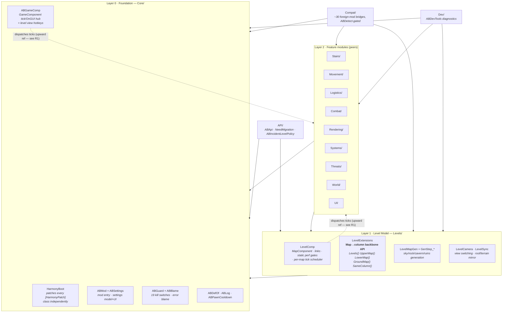
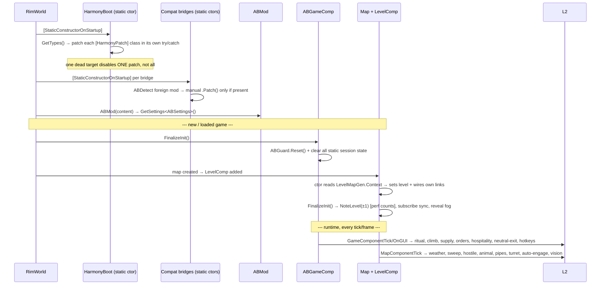
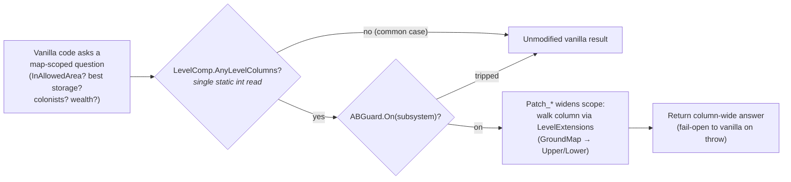

# As above, So below — Architecture

> **Living document.** This is the map of the system. Update it in the *same commit* as any
> structural change — a new module folder, a new tick hub, a new cross-cutting pattern, a
> renamed public API. If a diagram below no longer matches the code, the diagram is the bug.
>
> Last synced: 2026-07-26 · Pass 42 (tier-1 static perf gates).
> Regenerate the whole-codebase snapshot for high-level chats with `docs/generate-helicopter-view.sh`.

---

## 1. The one-sentence thesis

Stack up to three real, fully-simulated maps in one vertical column (sky `+1` / surface `0` /
basement `-1`) and make the whole column behave as **ONE BIG MAP** — by intercepting the vanilla
questions ("is this cell in the allowed area?", "where's the best storage?", "who are my
colonists?") with ~130 Harmony patches that widen the answer from a single `Map` to the whole
column, while a tier-1 static gate keeps every one of those patches free until a column exists.

Design priorities, in order: **(1)** visual clarity from the sky, **(2)** performance,
**(3)** full vanilla parity.

---

## 2. Codebase at a glance

| Metric | Count |
|---|---|
| C# files | 156 |
| C# lines | 41,982 |
| Defs + Patches XML files | 14 |
| Defs + Patches XML lines | 1,428 |
| All XML incl. About + Languages | 1,851 |
| **Total code (C# + Defs/Patches)** | **~43,410** |
| Declarative `Patch_*` Harmony classes | 110 |
| Imperative `.Patch()` calls (Compat) | 24 |
| `[HarmonyPatch]` attribute usages | 113 |
| Per-subsystem kill switches (`ABGuard`) | 19 |
| Foreign-mod compat bridges | ~30 |

Two files dominate and are the standing refactor candidates: `Dev/ABDevTools.cs` (2,559) and
`Logistics/CrossLevelDemand.cs` (1,489). See §7.

---

## 3. Repository map (ASCII)

```
50b4332c2547/                        mod root (folder id is opaque; identity lives in About.xml)
├─ About/                            About.xml (identity, deps, incompat) + Preview.png
├─ Assemblies/                       AsAboveSoBelow.dll  (build output — the ONLY shipped dll)
├─ Defs/                             XML content (1,428 LOC across 10 files)
│  ├─ Animations/  Biomes/  Buildings/     climb anims · basement biomes · stairs+links
│  ├─ Jobs/  KeyBindings/  MapGeneration/  cross-level jobs · view hotkeys · gen defs
│  ├─ Misc/  Terrain/  WorkGivers/         mesh flags · sky/basement terrain · haul givers
├─ Patches/                          PatchOperations: DBH/Rimefeller/VCHE/VEF vertical pipes
├─ Languages/English/Keyed/          C#-emitted strings (translate everything player-facing)
├─ Textures/                         stairs/ladder/elevator art (MORTON pack) + UI icons
└─ Source/                           C# (41,982 LOC, 156 files, one namespace: AsAboveSoBelow)
   │
   ├─ Core/        (1,674 · 8)   FOUNDATION — boot, settings, kill switches, tick hub
   ├─ API/         (  498 · 2)   PUBLIC modder surface — cross-level jobs, need migration, policy
   ├─ Levels/      (4,331 · 19)  LEVEL MODEL — LevelComp, LevelExtensions, generation, camera, sync
   │
   ├─ Stairs/      (1,898 · 6)   vertical links: buildings, use-job, climb animation
   ├─ Movement/    (3,776 · 9)   cross-level RMB orders, work-priority migration, targeting
   ├─ Logistics/   (6,834 · 26)  hauling, demand, column storage, needs, construction supply
   ├─ Combat/      (3,667 · 11)  cross-gap shooting, turrets, projectiles, formation drag
   ├─ Rendering/   (3,604 · 8)   see-below, section layers, DrawPos offset patcher
   ├─ Systems/     (2,957 · 12)  areas, climate, rituals, animals, utility grid links
   ├─ Threats/     (1,524 · 5)   pods to sky, infestations, hostile descent, raid diverts
   ├─ World/       (  575 · 4)   caravans, trade, wealth, comms, abandon warning
   ├─ UI/          (2,536 · 13)  colonist bar, alerts, tables, selection, play-settings buttons
   │
   ├─ Compat/      (5,549 · 30)  foreign-mod bridges (each [StaticConstructorOnStartup]+ABDetect)
   └─ Dev/         (2,559 · 1)   ABDevTools: in-game self-test / diagnostic debug actions
```
`(LOC · files)`. `obj/` and `bin/` are gitignored build scratch.

---

## 4. Layered dependency graph

Everything points **down**. The two dashed edges are the deliberate exception — the tick hubs
in the foundation reach *up* into features to dispatch per-tick work (see §6 and refactor R1).



**Reading it:** `LevelExtensions` is the single most-depended-on type — nearly every feature file
calls `map.Levels()` / `map.GroundMap()` / `a.SameColumn(b)`. If you change that API, expect
ripples everywhere. `ABGuard.On(...)` is the second: every hot path and every subsystem entry
point is wrapped in a kill switch.

---

## 5. Boot & lifecycle sequence



The **two tick hubs** are `ABGameComp` (per game) and `LevelComp.MapComponentTick` (per map).
Every recurring behavior is scheduled from one of these two places. Both early-out on a static
count read (`LevelComp.AnyLevelColumns`) so a zero-column game pays almost nothing.

---

## 6. The "ONE BIG MAP" request-interception pattern

This is the core idiom repeated ~110 times. Vanilla asks a scoped question about *one* map; a
`Patch_*` widens the scope to the whole column via `LevelExtensions`, gated for performance.



**Two invariants that make this safe:**
1. **The gate is a superset of every patch's real precondition.** `AnyLevelColumns` (sky-count +
   basement-count > 0, keyed to the current `Game` by weak reference) is true whenever *any*
   column exists anywhere, which is a strict superset of "this specific map is in a column." So
   early-outing on it is behavior-preserving — it can only skip patches that were going to no-op.
2. **Every subsystem fails open.** A `Patch_*` prefix that throws trips its `ABGuard` switch,
   logs once with a blamed culprit, and thereafter returns `true` (vanilla runs). One broken
   subsystem never cascades.

---

## 7. Module reference

| Module | LOC·files | Role | Key types |
|---|---|---|---|
| **Core** | 1,674·8 | Foundation: boot, settings, kill switches, tick hub | `HarmonyBoot` · `ABMod` · `ABSettings` · `ABGuard`/`ABBlame` · `ABGameComp` · `ABDefOf` |
| **API** | 498·2 | Public modder surface | `ABApi` · `NeedMigration` · `ABIncidentLevelPolicy` · `ABSkyfallerTransit` |
| **Levels** | 4,331·19 | The level model + generation + camera + sync | `LevelComp` · `LevelExtensions` · `LevelMapGen` · `GenStep_ABSkyTerrain/SolidRock/CavernCarve/UrbanRuins` · `LevelCamera` · `LevelSync` |
| **Stairs** | 1,898·6 | Vertical links | `Building_ABStairs`/`ABElevator`/`ABUtilityLink` · `JobDriver_UseStairs` · `ClimbAnimation` |
| **Movement** | 3,776·9 | Cross-level RMB orders + work-priority migration | `CrossLevelOrders` · `CrossLevelWork` · `CrossLevelTargeting` · `StairRouter`/`StairIslands` |
| **Logistics** | 6,834·26 | Hauling, demand, column storage, needs, supply | `CrossLevelHaul`/`HaulChain` · `CrossLevelDemand` · `ColumnStorage` · `ABGearAcrossLevels` · `WorkGiver_AB*` |
| **Combat** | 3,667·11 | Cross-gap shooting, turrets, formation drag | `CrossLevelCombat` · `CrossLevelTurret` · `CrossGapProjectiles` · `CrossLevelAutoEngage` · `ABBelowGotoDrag` |
| **Rendering** | 3,604·8 | See-below view + draw offsets | `LevelRenderer` · `DrawPosOffsetPatcher` · `SectionLayer_ABBelowThings/Ceiling/MountainCap/WallFacade/WallReveal` |
| **Systems** | 2,957·12 | Column-wide areas, climate, rituals, animals | `AreasAcrossLevels` · `ClimateSync`/`LevelClimate` · `ABRitualAttendance` · `CrossLevelAnimals` · `CompABGridLink` |
| **Threats** | 1,524·5 | Optional threats & arrivals | `HostileDescend` · `PodTransit` · `ThreatDivert` · `SkyArrivals` |
| **World** | 575·4 | Planet integration | `CaravanAcrossLevels` · `ColumnTrade` · `ColumnWorld` |
| **UI** | 2,536·13 | HUD, alerts, tables, selection | `BelowSelection` · `ABGenPreview` · `ABIcons`/`ABTheme` · `Dialog_ABDeleteLevel` |
| **Compat** | 5,549·30 | Foreign-mod bridges (ABDetect-gated) | DBH/Rimefeller/VEF pipes · CE · Vehicles · Hospitality · CAI5000 (`CrossLevelVision`) · Biomes Caverns · Ancient Urban Ruins |
| **Dev** | 2,559·1 | In-game self-test / diagnostics | `ABDevTools` |

---

## 8. Cross-cutting patterns (learn these once, they're everywhere)

- **`map.Levels()` backbone** (`Levels/LevelExtensions.cs`). Every column relationship goes
  through these extensions, `ConditionalWeakTable`-cached per map. `GroundMap()` self-heals by
  walking links when the field is unset (old saves). Never cache a `Map` link yourself — ask.
- **Kill switches** (`Core/ABGuard.cs`). 19 `ABGuardSwitch` singletons. Pattern: guard the entry
  (`if (!ABGuard.On(ABGuard.X)) return;`), `try { … } catch (e) { ABGuard.Disable(ABGuard.X, e, "ctx", subject); }`.
  Prefixes must **fail open**. Switches reset on load and are re-armable from settings.
- **Tier-1 static perf gates** (`LevelComp.AnySkyLevels` / `AnyBasementLevels` / `AnyLevelColumns`).
  First line of every hot cross-level patch. Superset of the real precondition ⇒ behavior-preserving.
  Keyed to `Current.Game` by weak reference; a stale count only ever *degrades* the optimization.
- **Two tick hubs.** `ABGameComp` (game-scoped) and `LevelComp.MapComponentTick` (map-scoped).
  All recurring work is scheduled here via elapsed-time `Due(ref due, now, interval)` with a
  per-map stagger, not `TicksGame % n` (modulo beats are missed across time-skips/loads).
- **Compat bridges** (`Compat/*`). Each is `[StaticConstructorOnStartup]` + `ABDetect` +
  manual `HarmonyBoot.Harmony.Patch(...)`, active only if the foreign mod is loaded. Bridges
  carry **no** `[HarmonyPatch]` attribute (so `HarmonyBoot` never reflects their foreign-typed
  method signatures — that was the "Skipped patch class RimefellerBridge" ghost-warning trap).
- **Localization.** Player-facing C# strings go through `"AB_Key".Translate()` with the key in
  `Languages/English/Keyed/AsAboveSoBelow.xml`. Def labels/descriptions are DefInjected (don't hand-author).

---

## 9. Refactor backlog (honest assessment)

Ordered by value ÷ risk. None are urgent — the mod ships green — but this is where the structural
debt is.

- **R1 · Tick-hub upward coupling (medium).** `ABGameComp` and `LevelComp.MapComponentTick`
  hardcode calls into a dozen feature subsystems (`CrossLevelCombat`, `HostileDescend`,
  `ABRitualAttendance`, `ABPipeCompat`, …), inverting the layer rule that foundation shouldn't
  know features. Adding a ticked feature means editing Core/Levels. *Fix:* a lightweight
  ordered tick-subscriber registry (`interface IABTickable { int Interval; void Tick(Map); }`
  registered at boot). *Trade-off:* costs the current explicit, greppable, deterministically-ordered
  list — and perf is priority #2, so any registry must preserve order and add zero per-tick
  allocation. Defensible to leave as-is; document it if so.
- **R2 · `Dev/ABDevTools.cs` is a 2,559-LOC monolith (low risk, high readability).** Split into
  per-domain partials mirroring the feature folders (`ABDevTools.Logistics.cs`, `.Combat.cs`, …).
  Dev-only, so zero gameplay risk.
- **R3 · Split `LevelComp` (medium).** It's the heart (679 LOC) but wears three hats: the level
  model (links/scribe), the static perf census, and the per-map tick scheduler. Extract
  `LevelCensus` (the static counts + gates) and `LevelTickScheduler` (the `Due`/interval logic)
  to shrink the class to just the model. Pairs naturally with R1.
- **R4 · Standardize the Compat boot contract (medium).** 30 bridges each hand-roll
  detect→patch→guard. An `IABCompatModule { bool Detect(); void Activate(); }` discovered by
  reflection would make the compat surface auditable and kill copy-paste, without changing the
  ABDetect gating. Watch the ghost-warning trap (R-note: keep bridges attribute-free).
- **R5 · Large service files (low).** `CrossLevelDemand` (1,489) and `LevelRenderer` (1,260) are
  the next split candidates *if they keep churning* — split along their internal responsibilities
  (demand model vs. pull-side fetch; mask build vs. section printing). Don't split preemptively.

---

## 10. How to keep this document alive

1. **New module folder** → add a row to §3, §4, §7.
2. **New tick hub or new recurring behavior** → update §5/§6 and the §8 tick-hub note.
3. **Changed `LevelExtensions` or `ABGuard` API** → update §4's "most-depended-on" note and §8.
4. **Landed a refactor** → strike it from §9 and reflect the new shape in the diagrams.
5. **Regenerate the helicopter view** (`docs/generate-helicopter-view.sh`) before any whole-project
   chat so the concatenated snapshot matches HEAD.
